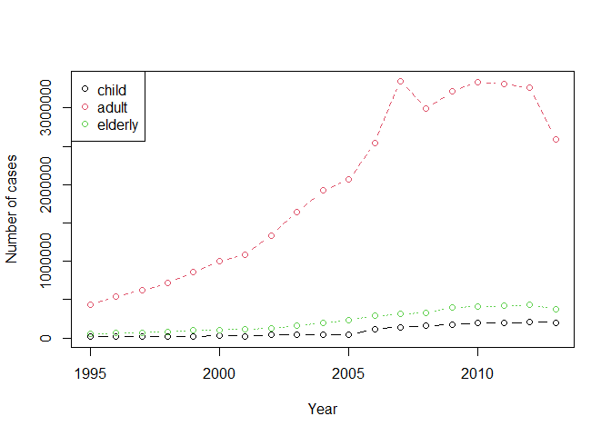
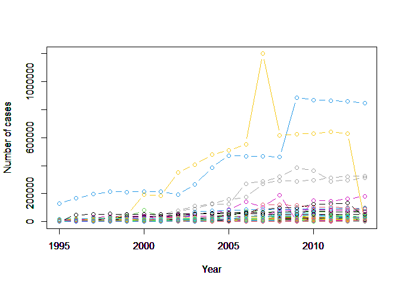

Wczytanie danych z cache’owaniem
--------------------------------

Do cache’owania wykorzystany został parametr *cache* ustawiony na
wartość *TRUE* w bloku kodu.

    library(EDAWR)
    library(dplyr)
    library(knitr)

    # Number of tuberculosis cases
    knitr::kable(head(tb))

<table>
<thead>
<tr class="header">
<th style="text-align: left;">country</th>
<th style="text-align: right;">year</th>
<th style="text-align: left;">sex</th>
<th style="text-align: right;">child</th>
<th style="text-align: right;">adult</th>
<th style="text-align: right;">elderly</th>
</tr>
</thead>
<tbody>
<tr class="odd">
<td style="text-align: left;">Afghanistan</td>
<td style="text-align: right;">1995</td>
<td style="text-align: left;">female</td>
<td style="text-align: right;">NA</td>
<td style="text-align: right;">NA</td>
<td style="text-align: right;">NA</td>
</tr>
<tr class="even">
<td style="text-align: left;">Afghanistan</td>
<td style="text-align: right;">1995</td>
<td style="text-align: left;">male</td>
<td style="text-align: right;">NA</td>
<td style="text-align: right;">NA</td>
<td style="text-align: right;">NA</td>
</tr>
<tr class="odd">
<td style="text-align: left;">Afghanistan</td>
<td style="text-align: right;">1996</td>
<td style="text-align: left;">female</td>
<td style="text-align: right;">NA</td>
<td style="text-align: right;">NA</td>
<td style="text-align: right;">NA</td>
</tr>
<tr class="even">
<td style="text-align: left;">Afghanistan</td>
<td style="text-align: right;">1996</td>
<td style="text-align: left;">male</td>
<td style="text-align: right;">NA</td>
<td style="text-align: right;">NA</td>
<td style="text-align: right;">NA</td>
</tr>
<tr class="odd">
<td style="text-align: left;">Afghanistan</td>
<td style="text-align: right;">1997</td>
<td style="text-align: left;">female</td>
<td style="text-align: right;">5</td>
<td style="text-align: right;">96</td>
<td style="text-align: right;">1</td>
</tr>
<tr class="even">
<td style="text-align: left;">Afghanistan</td>
<td style="text-align: right;">1997</td>
<td style="text-align: left;">male</td>
<td style="text-align: right;">0</td>
<td style="text-align: right;">26</td>
<td style="text-align: right;">0</td>
</tr>
</tbody>
</table>

Prezentacja podsumowania danych w zbiorze
-----------------------------------------

    knitr::kable(summary(tb))

<table style="width:100%;">
<colgroup>
<col style="width: 3%" />
<col style="width: 17%" />
<col style="width: 13%" />
<col style="width: 17%" />
<col style="width: 16%" />
<col style="width: 15%" />
<col style="width: 17%" />
</colgroup>
<thead>
<tr class="header">
<th style="text-align: left;"></th>
<th style="text-align: left;">country</th>
<th style="text-align: left;">year</th>
<th style="text-align: left;">sex</th>
<th style="text-align: left;">child</th>
<th style="text-align: left;">adult</th>
<th style="text-align: left;">elderly</th>
</tr>
</thead>
<tbody>
<tr class="odd">
<td style="text-align: left;"></td>
<td style="text-align: left;">Length:3800</td>
<td style="text-align: left;">Min. :1995</td>
<td style="text-align: left;">Length:3800</td>
<td style="text-align: left;">Min. : 0.0</td>
<td style="text-align: left;">Min. : 0</td>
<td style="text-align: left;">Min. : 0.0</td>
</tr>
<tr class="even">
<td style="text-align: left;"></td>
<td style="text-align: left;">Class :character</td>
<td style="text-align: left;">1st Qu.:1999</td>
<td style="text-align: left;">Class :character</td>
<td style="text-align: left;">1st Qu.: 25.0</td>
<td style="text-align: left;">1st Qu.: 1128</td>
<td style="text-align: left;">1st Qu.: 84.5</td>
</tr>
<tr class="odd">
<td style="text-align: left;"></td>
<td style="text-align: left;">Mode :character</td>
<td style="text-align: left;">Median :2004</td>
<td style="text-align: left;">Mode :character</td>
<td style="text-align: left;">Median : 76.0</td>
<td style="text-align: left;">Median : 2589</td>
<td style="text-align: left;">Median : 230.0</td>
</tr>
<tr class="even">
<td style="text-align: left;"></td>
<td style="text-align: left;">NA</td>
<td style="text-align: left;">Mean :2004</td>
<td style="text-align: left;">NA</td>
<td style="text-align: left;">Mean : 493.2</td>
<td style="text-align: left;">Mean : 10864</td>
<td style="text-align: left;">Mean : 1253.0</td>
</tr>
<tr class="odd">
<td style="text-align: left;"></td>
<td style="text-align: left;">NA</td>
<td style="text-align: left;">3rd Qu.:2009</td>
<td style="text-align: left;">NA</td>
<td style="text-align: left;">3rd Qu.: 264.5</td>
<td style="text-align: left;">3rd Qu.: 6706</td>
<td style="text-align: left;">3rd Qu.: 640.0</td>
</tr>
<tr class="even">
<td style="text-align: left;"></td>
<td style="text-align: left;">NA</td>
<td style="text-align: left;">Max. :2013</td>
<td style="text-align: left;">NA</td>
<td style="text-align: left;">Max. :25661.0</td>
<td style="text-align: left;">Max. :731540</td>
<td style="text-align: left;">Max. :125991.0</td>
</tr>
<tr class="odd">
<td style="text-align: left;"></td>
<td style="text-align: left;">NA</td>
<td style="text-align: left;">NA</td>
<td style="text-align: left;">NA</td>
<td style="text-align: left;">NA’s :396</td>
<td style="text-align: left;">NA’s :413</td>
<td style="text-align: left;">NA’s :413</td>
</tr>
</tbody>
</table>

Prezentacja liczby zachorowań z podziałem na płeć
-------------------------------------------------

    df_gsex <- tb %>%
      group_by(sex) %>%
      summarise_at(vars(child, adult, elderly), funs(sum), na.rm=TRUE)
    df_gsex$sum <- rowSums(df_gsex[,c("child", "adult", "elderly")])
    knitr::kable(df_gsex[, c("sex","sum")])

<table>
<thead>
<tr class="header">
<th style="text-align: left;">sex</th>
<th style="text-align: right;">sum</th>
</tr>
</thead>
<tbody>
<tr class="odd">
<td style="text-align: left;">female</td>
<td style="text-align: right;">15656162</td>
</tr>
<tr class="even">
<td style="text-align: left;">male</td>
<td style="text-align: right;">27062807</td>
</tr>
</tbody>
</table>

Prezentacja danych dla dzieci, dorosłych i osób starszych w kolejnych latach
----------------------------------------------------------------------------

    df_gyear <- tb %>%
      group_by(year) %>%
      summarise_at(vars(child, adult, elderly), funs(sum), na.rm=TRUE)
    matplot(df_gyear$year, df_gyear[,c("child", "adult", "elderly")], type = c("b"), pch=1, col = 1:3, xlab="Year", ylab="Number of cases")
    legend("topleft", legend = cbind("child", "adult", "elderly"), col=1:3, pch=1)

Prezentacja wykresów zachorowań w kolejnych latach dla poszczególnych krajów
----------------------------------------------------------------------------

    df_gcountry_year <- tb %>%
      group_by(country, year) %>%
      summarise_at(vars(child, adult, elderly), funs(sum), na.rm=TRUE)
    df_gcountry_year$sum <- rowSums(df_gcountry_year[,c("child", "adult", "elderly")])

    # All countries
    countries <- unique(df_gcountry_year$country)
    length(countries)

    ## [1] 100

    color=1
    for(i in countries){
      df_temp <- df_gcountry_year %>%
        filter(country == i) %>%
        select(c("country", "year", "sum"))
      matplot(df_temp$year, df_temp[,c('sum')], type = c("b"), pch=1, col = color, xlab="Year", ylab="Number of cases", ylim = c(0,max(df_gcountry_year$sum)))
      par(new=TRUE)
      color = color+1
    }

#### Uwaga kompilowane z użyciem polecenia

Nie używanie przycisku *Knit* w RStudio pozwala na uniknięcie blędów
cache’owania pierwszego bloku. Renderować raport można z pomocą
poniższej komendy.

    rmarkdown::render('zad_1.Rmd', output_format = 'html_document')
    # or
    rmarkdown::render('zad_1.Rmd', output_format = 'md_document')
