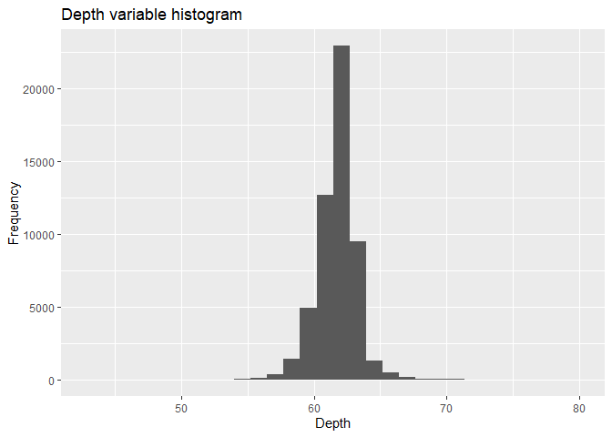
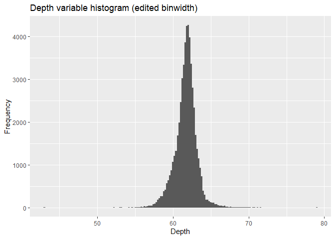
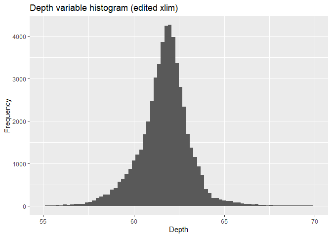
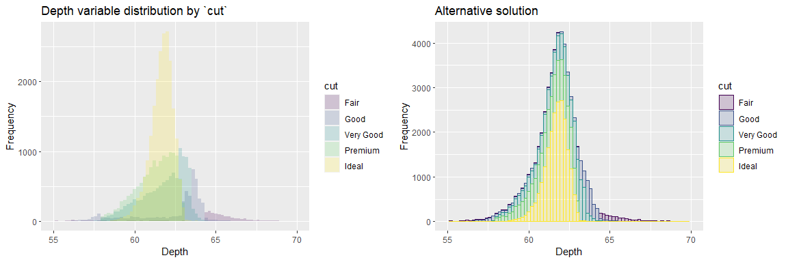
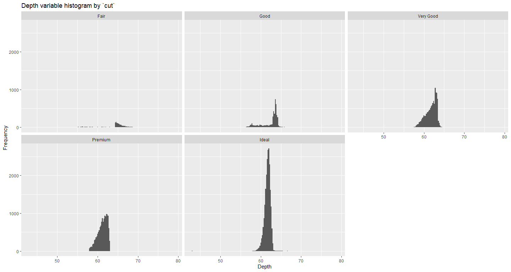
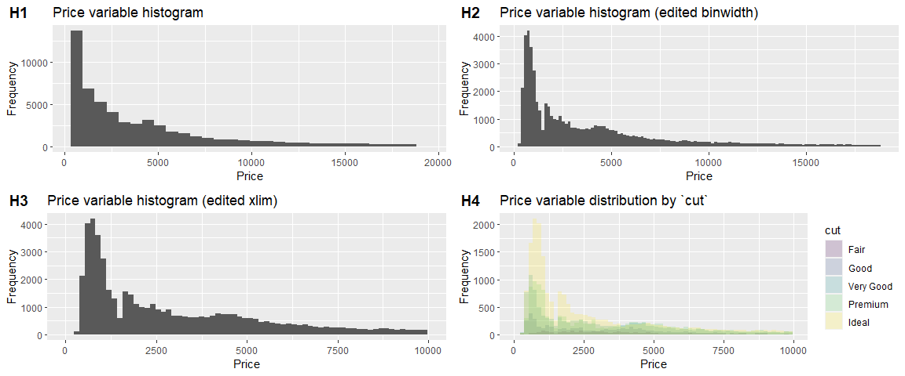
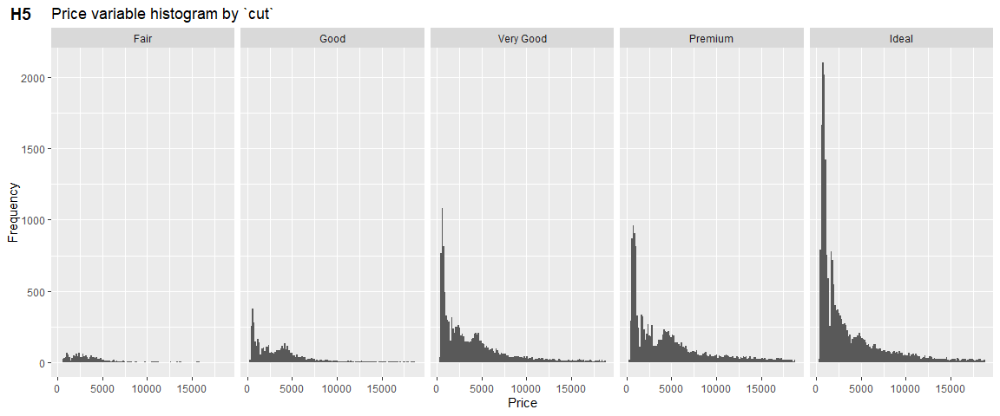
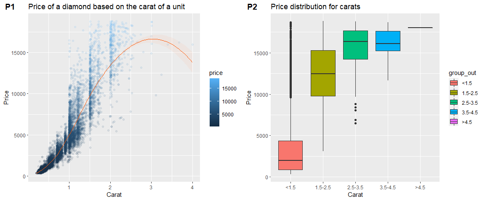

Wczytanie danych
----------------

    library(ggplot2)
    library(knitr)
    library(cowplot)

    data(diamonds)
    knitr::kable(summary(diamonds))

<table>
<colgroup>
<col style="width: 2%" />
<col style="width: 10%" />
<col style="width: 11%" />
<col style="width: 5%" />
<col style="width: 9%" />
<col style="width: 9%" />
<col style="width: 9%" />
<col style="width: 9%" />
<col style="width: 10%" />
<col style="width: 10%" />
<col style="width: 10%" />
</colgroup>
<thead>
<tr class="header">
<th style="text-align: left;"></th>
<th style="text-align: left;">carat</th>
<th style="text-align: left;">cut</th>
<th style="text-align: left;">color</th>
<th style="text-align: left;">clarity</th>
<th style="text-align: left;">depth</th>
<th style="text-align: left;">table</th>
<th style="text-align: left;">price</th>
<th style="text-align: left;">x</th>
<th style="text-align: left;">y</th>
<th style="text-align: left;">z</th>
</tr>
</thead>
<tbody>
<tr class="odd">
<td style="text-align: left;"></td>
<td style="text-align: left;">Min. :0.2000</td>
<td style="text-align: left;">Fair : 1610</td>
<td style="text-align: left;">D: 6775</td>
<td style="text-align: left;">SI1 :13065</td>
<td style="text-align: left;">Min. :43.00</td>
<td style="text-align: left;">Min. :43.00</td>
<td style="text-align: left;">Min. : 326</td>
<td style="text-align: left;">Min. : 0.000</td>
<td style="text-align: left;">Min. : 0.000</td>
<td style="text-align: left;">Min. : 0.000</td>
</tr>
<tr class="even">
<td style="text-align: left;"></td>
<td style="text-align: left;">1st Qu.:0.4000</td>
<td style="text-align: left;">Good : 4906</td>
<td style="text-align: left;">E: 9797</td>
<td style="text-align: left;">VS2 :12258</td>
<td style="text-align: left;">1st Qu.:61.00</td>
<td style="text-align: left;">1st Qu.:56.00</td>
<td style="text-align: left;">1st Qu.: 950</td>
<td style="text-align: left;">1st Qu.: 4.710</td>
<td style="text-align: left;">1st Qu.: 4.720</td>
<td style="text-align: left;">1st Qu.: 2.910</td>
</tr>
<tr class="odd">
<td style="text-align: left;"></td>
<td style="text-align: left;">Median :0.7000</td>
<td style="text-align: left;">Very Good:12082</td>
<td style="text-align: left;">F: 9542</td>
<td style="text-align: left;">SI2 : 9194</td>
<td style="text-align: left;">Median :61.80</td>
<td style="text-align: left;">Median :57.00</td>
<td style="text-align: left;">Median : 2401</td>
<td style="text-align: left;">Median : 5.700</td>
<td style="text-align: left;">Median : 5.710</td>
<td style="text-align: left;">Median : 3.530</td>
</tr>
<tr class="even">
<td style="text-align: left;"></td>
<td style="text-align: left;">Mean :0.7979</td>
<td style="text-align: left;">Premium :13791</td>
<td style="text-align: left;">G:11292</td>
<td style="text-align: left;">VS1 : 8171</td>
<td style="text-align: left;">Mean :61.75</td>
<td style="text-align: left;">Mean :57.46</td>
<td style="text-align: left;">Mean : 3933</td>
<td style="text-align: left;">Mean : 5.731</td>
<td style="text-align: left;">Mean : 5.735</td>
<td style="text-align: left;">Mean : 3.539</td>
</tr>
<tr class="odd">
<td style="text-align: left;"></td>
<td style="text-align: left;">3rd Qu.:1.0400</td>
<td style="text-align: left;">Ideal :21551</td>
<td style="text-align: left;">H: 8304</td>
<td style="text-align: left;">VVS2 : 5066</td>
<td style="text-align: left;">3rd Qu.:62.50</td>
<td style="text-align: left;">3rd Qu.:59.00</td>
<td style="text-align: left;">3rd Qu.: 5324</td>
<td style="text-align: left;">3rd Qu.: 6.540</td>
<td style="text-align: left;">3rd Qu.: 6.540</td>
<td style="text-align: left;">3rd Qu.: 4.040</td>
</tr>
<tr class="even">
<td style="text-align: left;"></td>
<td style="text-align: left;">Max. :5.0100</td>
<td style="text-align: left;">NA</td>
<td style="text-align: left;">I: 5422</td>
<td style="text-align: left;">VVS1 : 3655</td>
<td style="text-align: left;">Max. :79.00</td>
<td style="text-align: left;">Max. :95.00</td>
<td style="text-align: left;">Max. :18823</td>
<td style="text-align: left;">Max. :10.740</td>
<td style="text-align: left;">Max. :58.900</td>
<td style="text-align: left;">Max. :31.800</td>
</tr>
<tr class="odd">
<td style="text-align: left;"></td>
<td style="text-align: left;">NA</td>
<td style="text-align: left;">NA</td>
<td style="text-align: left;">J: 2808</td>
<td style="text-align: left;">(Other): 2531</td>
<td style="text-align: left;">NA</td>
<td style="text-align: left;">NA</td>
<td style="text-align: left;">NA</td>
<td style="text-align: left;">NA</td>
<td style="text-align: left;">NA</td>
<td style="text-align: left;">NA</td>
</tr>
</tbody>
</table>

Histogram dla zmiennej `depth`
------------------------------

    ggplot(data=diamonds) + geom_histogram(aes(x=depth)) + ggtitle("Depth variable histogram") + xlab("Depth") + ylab("Frequency")

    ## `stat_bin()` using `bins = 30`. Pick better value with `binwidth`.

Ustawienie szerokoci kubełka histogramu na wartość *0.2*
--------------------------------------------------------

    ggplot(data=diamonds) + geom_histogram(binwidth=0.2, aes(x=depth)) + ggtitle("Depth variable histogram (edited binwidth)") + xlab("Depth") + ylab("Frequency")

Ograniczenie osi *x* do przedziału *\[55, 70\]*
-----------------------------------------------

    ggplot(data=diamonds) + geom_histogram(binwidth=0.2, aes(x=depth)) + ggtitle("Depth variable histogram (edited xlim)") + xlab("Depth") + ylab("Frequency") + xlim(55, 70)

Jak zmienna `cut` wpływa na histogram
-------------------------------------

#### a) w wykorzystaniem koloru

    h4_1 <- ggplot(diamonds, aes(x=depth, fill=cut)) + geom_histogram(binwidth=0.2, alpha=0.2, position="identity") + ggtitle("Depth variable distribution by `cut`") + xlab("Depth") + ylab("Frequency") + xlim(55, 70)
    # alternative solution with boxplot
    h4_2 <- ggplot(diamonds, aes(depth, color=cut, fill=cut)) + geom_histogram(binwidth=0.2, alpha=0.2) + ggtitle("Alternative solution") + xlab("Depth") + ylab("Frequency") + xlim(55, 70)

    plot_grid(h4_1, h4_2)

#### b) z wykorzystaniem paneli

    ggplot(data=diamonds) + geom_histogram(binwidth=0.2, aes(x=depth)) + ggtitle("Depth variable histogram by `cut`") + xlab("Depth") + ylab("Frequency") + facet_wrap(~cut)

Powtórzenie wcześniejszych kroków dla zmiennej `price`
------------------------------------------------------

    h1 <- ggplot(data=diamonds) + geom_histogram(aes(x=price)) + ggtitle("Price variable histogram") + xlab("Price") + ylab("Frequency")

    h2 <- ggplot(data=diamonds) + geom_histogram(binwidth=150, aes(x=price)) + ggtitle("Price variable histogram (edited binwidth)") + xlab("Price") + ylab("Frequency")

    h3 <- ggplot(data=diamonds) + geom_histogram(binwidth=150, aes(x=price)) + ggtitle("Price variable histogram (edited xlim)") + xlab("Price") + ylab("Frequency") + xlim(0, 10000)

    # h4 <- ggplot(diamonds, aes(x=price, fill=cut)) + geom_histogram(alpha=0.2, position="identity") + ggtitle("Price variable distribution by `cut`") + xlab("Cut") + ylab("Price")
    h4 <- ggplot(diamonds, aes(x=price, fill=cut)) + geom_histogram(binwidth=150, alpha=0.2, position="identity")  + ggtitle("Price variable distribution by `cut`") + xlab("Price") + ylab("Frequency") + xlim(0, 10000)

    h5 <- ggplot(data=diamonds) + geom_histogram(binwidth=150, aes(x=price)) + ggtitle("Price variable histogram by `cut`") + xlab("Price") + ylab("Frequency") + facet_wrap(~cut, ncol = 5)

    # Display
    plot_grid(h1,h2,h3,h4, labels=c("H1", "H2", "H3", "H4"), ncol=2, nrow=2)

    ## `stat_bin()` using `bins = 30`. Pick better value with `binwidth`.

    plot_grid(h5, labels=c("H5"))

Wizualizacja relacji między zmiennymi `carat` i `price`
-------------------------------------------------------

    set.seed(42)
    dsamp <- diamonds[sample(nrow(diamonds), 10000),]
    p <- ggplot(dsamp, aes(carat, price, color=price)) + geom_jitter(alpha=0.1) + ggtitle("Price of a diamond based on the carat of a unit") + xlab("Carat") + ylab("Price") + geom_smooth(method='loess', size=0.5, se=TRUE, fill="#ffaa80", colour="#ff5500", alpha=0.1)

    bdiamonds <- transform(diamonds, group_out=cut(carat, breaks=c(-Inf,1.5, 2.5, 3.5, 4.5, Inf), labels=c("<1.5", "1.5-2.5", "2.5-3.5", "3.5-4.5", ">4.5")))
    p2 <- ggplot(bdiamonds, aes(factor(group_out), price, fill=group_out)) + geom_boxplot() + ggtitle("Price distribution for carats") + xlab("Carat") + ylab("Price")

    plot_grid(p, p2, labels=c("P1", "P2"))

    ## `geom_smooth()` using formula 'y ~ x'

