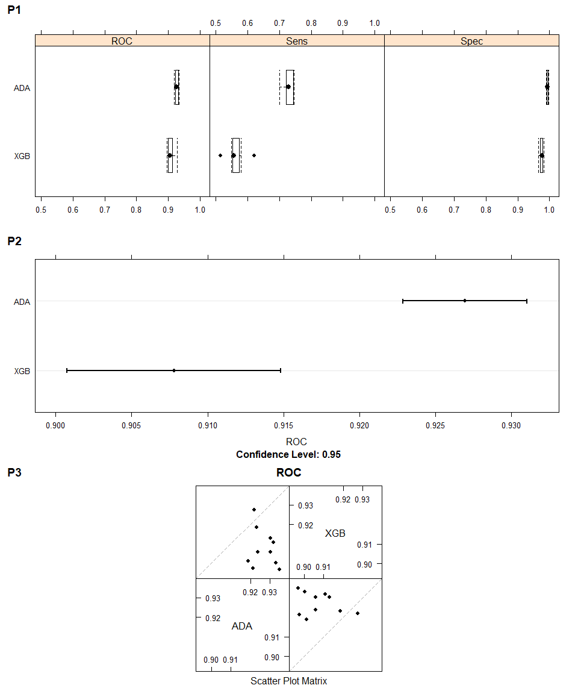

Część 1
=======

### Wczytanie danych

    library(modeldata)
    library(caret)
    library(cowplot)

    data(mlc_churn)
    churnData <- data.frame(mlc_churn)
    knitr::kable(summary(churnData))

<table style="width:100%;">
<colgroup>
<col style="width: 0%" />
<col style="width: 3%" />
<col style="width: 4%" />
<col style="width: 5%" />
<col style="width: 5%" />
<col style="width: 4%" />
<col style="width: 6%" />
<col style="width: 5%" />
<col style="width: 4%" />
<col style="width: 4%" />
<col style="width: 5%" />
<col style="width: 4%" />
<col style="width: 4%" />
<col style="width: 5%" />
<col style="width: 5%" />
<col style="width: 5%" />
<col style="width: 5%" />
<col style="width: 4%" />
<col style="width: 5%" />
<col style="width: 8%" />
<col style="width: 2%" />
</colgroup>
<thead>
<tr class="header">
<th style="text-align: left;"></th>
<th style="text-align: left;">state</th>
<th style="text-align: left;">account_length</th>
<th style="text-align: left;">area_code</th>
<th style="text-align: left;">international_plan</th>
<th style="text-align: left;">voice_mail_plan</th>
<th style="text-align: left;">number_vmail_messages</th>
<th style="text-align: left;">total_day_minutes</th>
<th style="text-align: left;">total_day_calls</th>
<th style="text-align: left;">total_day_charge</th>
<th style="text-align: left;">total_eve_minutes</th>
<th style="text-align: left;">total_eve_calls</th>
<th style="text-align: left;">total_eve_charge</th>
<th style="text-align: left;">total_night_minutes</th>
<th style="text-align: left;">total_night_calls</th>
<th style="text-align: left;">total_night_charge</th>
<th style="text-align: left;">total_intl_minutes</th>
<th style="text-align: left;">total_intl_calls</th>
<th style="text-align: left;">total_intl_charge</th>
<th style="text-align: left;">number_customer_service_calls</th>
<th style="text-align: left;">churn</th>
</tr>
</thead>
<tbody>
<tr class="odd">
<td style="text-align: left;"></td>
<td style="text-align: left;">WV : 158</td>
<td style="text-align: left;">Min. : 1.0</td>
<td style="text-align: left;">area_code_408:1259</td>
<td style="text-align: left;">no :4527</td>
<td style="text-align: left;">no :3677</td>
<td style="text-align: left;">Min. : 0.000</td>
<td style="text-align: left;">Min. : 0.0</td>
<td style="text-align: left;">Min. : 0</td>
<td style="text-align: left;">Min. : 0.00</td>
<td style="text-align: left;">Min. : 0.0</td>
<td style="text-align: left;">Min. : 0.0</td>
<td style="text-align: left;">Min. : 0.00</td>
<td style="text-align: left;">Min. : 0.0</td>
<td style="text-align: left;">Min. : 0.00</td>
<td style="text-align: left;">Min. : 0.000</td>
<td style="text-align: left;">Min. : 0.00</td>
<td style="text-align: left;">Min. : 0.000</td>
<td style="text-align: left;">Min. :0.000</td>
<td style="text-align: left;">Min. :0.00</td>
<td style="text-align: left;">yes: 707</td>
</tr>
<tr class="even">
<td style="text-align: left;"></td>
<td style="text-align: left;">MN : 125</td>
<td style="text-align: left;">1st Qu.: 73.0</td>
<td style="text-align: left;">area_code_415:2495</td>
<td style="text-align: left;">yes: 473</td>
<td style="text-align: left;">yes:1323</td>
<td style="text-align: left;">1st Qu.: 0.000</td>
<td style="text-align: left;">1st Qu.:143.7</td>
<td style="text-align: left;">1st Qu.: 87</td>
<td style="text-align: left;">1st Qu.:24.43</td>
<td style="text-align: left;">1st Qu.:166.4</td>
<td style="text-align: left;">1st Qu.: 87.0</td>
<td style="text-align: left;">1st Qu.:14.14</td>
<td style="text-align: left;">1st Qu.:166.9</td>
<td style="text-align: left;">1st Qu.: 87.00</td>
<td style="text-align: left;">1st Qu.: 7.510</td>
<td style="text-align: left;">1st Qu.: 8.50</td>
<td style="text-align: left;">1st Qu.: 3.000</td>
<td style="text-align: left;">1st Qu.:2.300</td>
<td style="text-align: left;">1st Qu.:1.00</td>
<td style="text-align: left;">no :4293</td>
</tr>
<tr class="odd">
<td style="text-align: left;"></td>
<td style="text-align: left;">AL : 124</td>
<td style="text-align: left;">Median :100.0</td>
<td style="text-align: left;">area_code_510:1246</td>
<td style="text-align: left;">NA</td>
<td style="text-align: left;">NA</td>
<td style="text-align: left;">Median : 0.000</td>
<td style="text-align: left;">Median :180.1</td>
<td style="text-align: left;">Median :100</td>
<td style="text-align: left;">Median :30.62</td>
<td style="text-align: left;">Median :201.0</td>
<td style="text-align: left;">Median :100.0</td>
<td style="text-align: left;">Median :17.09</td>
<td style="text-align: left;">Median :200.4</td>
<td style="text-align: left;">Median :100.00</td>
<td style="text-align: left;">Median : 9.020</td>
<td style="text-align: left;">Median :10.30</td>
<td style="text-align: left;">Median : 4.000</td>
<td style="text-align: left;">Median :2.780</td>
<td style="text-align: left;">Median :1.00</td>
<td style="text-align: left;">NA</td>
</tr>
<tr class="even">
<td style="text-align: left;"></td>
<td style="text-align: left;">ID : 119</td>
<td style="text-align: left;">Mean :100.3</td>
<td style="text-align: left;">NA</td>
<td style="text-align: left;">NA</td>
<td style="text-align: left;">NA</td>
<td style="text-align: left;">Mean : 7.755</td>
<td style="text-align: left;">Mean :180.3</td>
<td style="text-align: left;">Mean :100</td>
<td style="text-align: left;">Mean :30.65</td>
<td style="text-align: left;">Mean :200.6</td>
<td style="text-align: left;">Mean :100.2</td>
<td style="text-align: left;">Mean :17.05</td>
<td style="text-align: left;">Mean :200.4</td>
<td style="text-align: left;">Mean : 99.92</td>
<td style="text-align: left;">Mean : 9.018</td>
<td style="text-align: left;">Mean :10.26</td>
<td style="text-align: left;">Mean : 4.435</td>
<td style="text-align: left;">Mean :2.771</td>
<td style="text-align: left;">Mean :1.57</td>
<td style="text-align: left;">NA</td>
</tr>
<tr class="odd">
<td style="text-align: left;"></td>
<td style="text-align: left;">VA : 118</td>
<td style="text-align: left;">3rd Qu.:127.0</td>
<td style="text-align: left;">NA</td>
<td style="text-align: left;">NA</td>
<td style="text-align: left;">NA</td>
<td style="text-align: left;">3rd Qu.:17.000</td>
<td style="text-align: left;">3rd Qu.:216.2</td>
<td style="text-align: left;">3rd Qu.:113</td>
<td style="text-align: left;">3rd Qu.:36.75</td>
<td style="text-align: left;">3rd Qu.:234.1</td>
<td style="text-align: left;">3rd Qu.:114.0</td>
<td style="text-align: left;">3rd Qu.:19.90</td>
<td style="text-align: left;">3rd Qu.:234.7</td>
<td style="text-align: left;">3rd Qu.:113.00</td>
<td style="text-align: left;">3rd Qu.:10.560</td>
<td style="text-align: left;">3rd Qu.:12.00</td>
<td style="text-align: left;">3rd Qu.: 6.000</td>
<td style="text-align: left;">3rd Qu.:3.240</td>
<td style="text-align: left;">3rd Qu.:2.00</td>
<td style="text-align: left;">NA</td>
</tr>
<tr class="even">
<td style="text-align: left;"></td>
<td style="text-align: left;">OH : 116</td>
<td style="text-align: left;">Max. :243.0</td>
<td style="text-align: left;">NA</td>
<td style="text-align: left;">NA</td>
<td style="text-align: left;">NA</td>
<td style="text-align: left;">Max. :52.000</td>
<td style="text-align: left;">Max. :351.5</td>
<td style="text-align: left;">Max. :165</td>
<td style="text-align: left;">Max. :59.76</td>
<td style="text-align: left;">Max. :363.7</td>
<td style="text-align: left;">Max. :170.0</td>
<td style="text-align: left;">Max. :30.91</td>
<td style="text-align: left;">Max. :395.0</td>
<td style="text-align: left;">Max. :175.00</td>
<td style="text-align: left;">Max. :17.770</td>
<td style="text-align: left;">Max. :20.00</td>
<td style="text-align: left;">Max. :20.000</td>
<td style="text-align: left;">Max. :5.400</td>
<td style="text-align: left;">Max. :9.00</td>
<td style="text-align: left;">NA</td>
</tr>
<tr class="odd">
<td style="text-align: left;"></td>
<td style="text-align: left;">(Other):4240</td>
<td style="text-align: left;">NA</td>
<td style="text-align: left;">NA</td>
<td style="text-align: left;">NA</td>
<td style="text-align: left;">NA</td>
<td style="text-align: left;">NA</td>
<td style="text-align: left;">NA</td>
<td style="text-align: left;">NA</td>
<td style="text-align: left;">NA</td>
<td style="text-align: left;">NA</td>
<td style="text-align: left;">NA</td>
<td style="text-align: left;">NA</td>
<td style="text-align: left;">NA</td>
<td style="text-align: left;">NA</td>
<td style="text-align: left;">NA</td>
<td style="text-align: left;">NA</td>
<td style="text-align: left;">NA</td>
<td style="text-align: left;">NA</td>
<td style="text-align: left;">NA</td>
<td style="text-align: left;">NA</td>
</tr>
</tbody>
</table>

### Podział na zbiór treningowy i testowy

    set.seed(42)
    inTraining <- createDataPartition(
      y = churnData$churn,
      p = .7,
      list = FALSE)

    trainChurnData <- churnData[inTraining,]
    testChurnData <- churnData[-inTraining,]

    print(nrow(trainChurnData))

    ## [1] 3501

    print(nrow(testChurnData))

    ## [1] 1499

### Test algorytmów klasyfikacyjnych

W treningu wykorzytana została metoda *resmaplingu* - *Cross-validation*
z parametrem dwóch foldów. W eksperymencie porównano metody *Adaboost* i
*XGBoost*, obie bazujące na koncepcie drzew decyzyjnych.

    # Defining train control
    ctrl <- trainControl(
      method = "cv",
      number = 2)

    # Training
    set.seed(42)

    # Adaboost
    model_ab <- train(
      churn ~ .,
      data = trainChurnData,
      method = "adaboost",
      trControl = ctrl)

    # XGBoost
    model_xgb <- train(
      churn ~ .,
      data = trainChurnData,
      method = "xgbTree",
      trControl = ctrl)

Poniżej widać ewaluację modeli bez *preprocessingu* i przeszukiwania
przestrzeni hiperparametrów z wykorzystaniem macierzy pomyłek i
dodatkowych statystyk. W rezultacie algorytm *Adaboost* uzyskał
wyższ&\#261 trafność. *Adaboost* lepiej też radzi sobie chociażby z
klasyfikacją klasy mniejszościowej.

    # Evaluation with confusion matrix for Adaboost
    rfClasses <- predict(model_ab, newdata = testChurnData)
    confusionMatrix(data = rfClasses, testChurnData$churn)

    ## Confusion Matrix and Statistics
    ## 
    ##           Reference
    ## Prediction  yes   no
    ##        yes  154   10
    ##        no    58 1277
    ##                                           
    ##                Accuracy : 0.9546          
    ##                  95% CI : (0.9428, 0.9646)
    ##     No Information Rate : 0.8586          
    ##     P-Value [Acc > NIR] : < 2.2e-16       
    ##                                           
    ##                   Kappa : 0.7937          
    ##                                           
    ##  Mcnemar's Test P-Value : 1.201e-08       
    ##                                           
    ##             Sensitivity : 0.7264          
    ##             Specificity : 0.9922          
    ##          Pos Pred Value : 0.9390          
    ##          Neg Pred Value : 0.9566          
    ##              Prevalence : 0.1414          
    ##          Detection Rate : 0.1027          
    ##    Detection Prevalence : 0.1094          
    ##       Balanced Accuracy : 0.8593          
    ##                                           
    ##        'Positive' Class : yes             
    ## 

    # Evaluation with confusion matrix for XGBoost
    rfClasses <- predict(model_xgb, newdata = testChurnData)
    confusionMatrix(data = rfClasses, testChurnData$churn)

    ## Confusion Matrix and Statistics
    ## 
    ##           Reference
    ## Prediction  yes   no
    ##        yes  155   16
    ##        no    57 1271
    ##                                           
    ##                Accuracy : 0.9513          
    ##                  95% CI : (0.9392, 0.9616)
    ##     No Information Rate : 0.8586          
    ##     P-Value [Acc > NIR] : < 2.2e-16       
    ##                                           
    ##                   Kappa : 0.7818          
    ##                                           
    ##  Mcnemar's Test P-Value : 2.846e-06       
    ##                                           
    ##             Sensitivity : 0.7311          
    ##             Specificity : 0.9876          
    ##          Pos Pred Value : 0.9064          
    ##          Neg Pred Value : 0.9571          
    ##              Prevalence : 0.1414          
    ##          Detection Rate : 0.1034          
    ##    Detection Prevalence : 0.1141          
    ##       Balanced Accuracy : 0.8594          
    ##                                           
    ##        'Positive' Class : yes             
    ## 

Czy warto wstępnie przetworzyć dane?

Tak, uważam, że zawsze warto wstępnie przetworzyć dane. Wiele algorytmów
znacznie zyskuje na normalizacji danych, wybraniu istotnych cech
(*feature selection*) czy dodaniu nowych cech (*feature engeneering*).
Dodatkowo trzeba też zadbać o interpretację wartości niezdefiniowanych
czy atrybuty kategorialne.

Przykład wstępnego przetworzenia danych, które pomogło poprawić wyniki
jest poniżej. Warto wspomnieć, że prawdopodobnie bardziej imponujące
rezultaty możnaby uzyskać np. dla algorytmów mocno wrażliwych na
normalizację.

    # Training
    set.seed(42)

    model_pre <- train(
      churn ~ .,
      data = trainChurnData,
      method = "adaboost",
      trControl = ctrl,
      # Preprocessing
      preProc = c("center", "scale", "nzv"))

    # Evaluating
    rfClasses <- predict(model_pre, newdata = testChurnData)
    confusionMatrix(data = rfClasses, testChurnData$churn)

    ## Confusion Matrix and Statistics
    ## 
    ##           Reference
    ## Prediction  yes   no
    ##        yes  163   12
    ##        no    49 1275
    ##                                          
    ##                Accuracy : 0.9593         
    ##                  95% CI : (0.948, 0.9687)
    ##     No Information Rate : 0.8586         
    ##     P-Value [Acc > NIR] : < 2.2e-16      
    ##                                          
    ##                   Kappa : 0.8193         
    ##                                          
    ##  Mcnemar's Test P-Value : 4.04e-06       
    ##                                          
    ##             Sensitivity : 0.7689         
    ##             Specificity : 0.9907         
    ##          Pos Pred Value : 0.9314         
    ##          Neg Pred Value : 0.9630         
    ##              Prevalence : 0.1414         
    ##          Detection Rate : 0.1087         
    ##    Detection Prevalence : 0.1167         
    ##       Balanced Accuracy : 0.8798         
    ##                                          
    ##        'Positive' Class : yes            
    ## 

### Przeszukiwanie przestrzeni parametrów

W ostatnim w tej części fragmencie kodu pokazane jest strojenie
hiperparametrów.

Dla algorytmu *AdaBoost* strojony jest parametr *nIter*, który odpowiada
za liczbę operacji boostowania. Drugim strojonym parametrem jest
metoda/implementacja wykorzystywanego modelu *Adaboost*.

Dla algorytmu *XGBoost* strojone są parametry *nrounds*, *max\_depth* i
*eta*. Kolejno oznaczają one: liczba rund w których trenowane są kolejne
iteracje drzew decyzyjnych, maksymalną głębokość drzewa i parametr
bliźniaczy do *learning rate* i pozwalający uniknąć przetrenowania.

    set.seed(42)

    # Adaboost
    adaGrid <- expand.grid(
      nIter = c(50, 500),
      method = c("Adaboost.M1", "Real adaboost")
    )

    gridCtrl <- trainControl(
      method = "repeatedcv",
      number = 2,
      repeats = 5,
      summaryFunction = twoClassSummary,
      classProbs = TRUE
    )

    model_ada <- train(
      churn ~ .,
      data = trainChurnData,
      method = "adaboost",
      metric = "ROC",
      trControl = gridCtrl,
      tuneGrid = adaGrid,
      preProc = c("center", "scale", "nzv"))

    print(model_ada)

    ## AdaBoost Classification Trees 
    ## 
    ## 3501 samples
    ##   19 predictor
    ##    2 classes: 'yes', 'no' 
    ## 
    ## Pre-processing: centered (18), scaled (18), remove (51) 
    ## Resampling: Cross-Validated (2 fold, repeated 5 times) 
    ## Summary of sample sizes: 1750, 1751, 1750, 1751, 1751, 1750, ... 
    ## Resampling results across tuning parameters:
    ## 
    ##   nIter  method         ROC        Sens       Spec     
    ##    50    Adaboost.M1    0.9233023  0.7312916  0.9904192
    ##    50    Real adaboost  0.4952378  0.2674693  0.9988024
    ##   500    Adaboost.M1    0.9269392  0.7288739  0.9930805
    ##   500    Real adaboost  0.5215369  0.2468509  0.9996673
    ## 
    ## ROC was used to select the optimal model using the largest value.
    ## The final values used for the model were nIter = 500 and method = Adaboost.M1.

    # ----------------------------------------------
    # XGBoost
    xgbGrid <- expand.grid(
      nrounds = c(50, 500),
      max_depth = c(4, 6),
      eta = c(.2, .3, .4),
      gamma = 5,
      colsample_bytree = .5,
      min_child_weight = 10,
      subsample = .5
    )

    model_xgb <- train(
      churn ~ .,
      data = trainChurnData,
      method = "xgbTree",
      metric = "ROC",
      trControl = gridCtrl,
      tuneGrid = xgbGrid,
      preProc = c("center", "scale", "nzv"))

    print(model_xgb)

    ## eXtreme Gradient Boosting 
    ## 
    ## 3501 samples
    ##   19 predictor
    ##    2 classes: 'yes', 'no' 
    ## 
    ## Pre-processing: centered (18), scaled (18), remove (51) 
    ## Resampling: Cross-Validated (2 fold, repeated 5 times) 
    ## Summary of sample sizes: 1751, 1750, 1751, 1750, 1751, 1750, ... 
    ## Resampling results across tuning parameters:
    ## 
    ##   eta  max_depth  nrounds  ROC        Sens       Spec     
    ##   0.2  4           50      0.9026819  0.4408254  0.9803061
    ##   0.2  4          500      0.9077895  0.5620037  0.9748503
    ##   0.2  6           50      0.9021911  0.4387946  0.9793081
    ##   0.2  6          500      0.9065040  0.5531197  0.9760479
    ##   0.3  4           50      0.9026212  0.4978076  0.9748503
    ##   0.3  4          500      0.9045554  0.5628591  0.9728543
    ##   0.3  6           50      0.9035844  0.4941655  0.9765802
    ##   0.3  6          500      0.9065441  0.5632314  0.9733200
    ##   0.4  4           50      0.8983699  0.4872992  0.9739854
    ##   0.4  4          500      0.8970713  0.5418604  0.9707917
    ##   0.4  6           50      0.9023811  0.5167477  0.9737858
    ##   0.4  6          500      0.9035350  0.5713253  0.9727878
    ## 
    ## Tuning parameter 'gamma' was held constant at a value of 5
    ## Tuning parameter 'colsample_bytree' was held constant at a value of 0.5
    ## Tuning
    ##  parameter 'min_child_weight' was held constant at a value of 10
    ## Tuning parameter 'subsample' was held constant at a value of 0.5
    ## ROC was used to select the optimal model using the largest value.
    ## The final values used for the model were nrounds = 500, max_depth = 4, eta = 0.2, gamma = 5, colsample_bytree = 0.5, min_child_weight = 10
    ##  and subsample = 0.5.

### Porównanie wybranych algorytmów za pomocą wykresów

    set.seed(42)

    resamps <- resamples(list(ADA = model_ada,
                              XGB = model_xgb))

    # Plot 1
    theme1 <- trellis.par.get()
    theme1$plot.symbol$col = rgb(.2, .2, .2, .4)
    theme1$plot.symbol$pch = 16
    theme1$plot.line$col = rgb(1, 0, 0, .7)
    theme1$plot.line$lwd <- 2
    trellis.par.set(theme1)
    plot1 <- bwplot(resamps, layout = c(3, 1))

    # Plot 2
    trellis.par.set(caretTheme())
    plot2 <- dotplot(resamps, metric = "ROC")

    # Plot3
    plot3 <- splom(resamps)

    plot_grid(plot1, plot2, plot3, labels=c("P1", "P2", "P3"), ncol=1, nrow=3)

    # Differences between models
    difValues <- diff(resamps)

    # Plot 1
    trellis.par.set(theme1)
    plot1 <- bwplot(difValues, layout = c(3, 1))

    # Plot 2
    trellis.par.set(caretTheme())
    plot2 <- dotplot(difValues)

    plot_grid(plot1, plot2, labels=c("P1", "P2"), ncol=1, nrow=2)

Część 2
=======

### Ładowanie danych

    library(ggplot2)
    library(dplyr)

    ## 
    ## Attaching package: 'dplyr'

    ## The following objects are masked from 'package:stats':
    ## 
    ##     filter, lag

    ## The following objects are masked from 'package:base':
    ## 
    ##     intersect, setdiff, setequal, union

    data(diamonds)
    diamonds <- data.frame(diamonds)
    knitr::kable(summary(diamonds))

<table>
<colgroup>
<col style="width: 2%" />
<col style="width: 10%" />
<col style="width: 11%" />
<col style="width: 5%" />
<col style="width: 9%" />
<col style="width: 9%" />
<col style="width: 9%" />
<col style="width: 9%" />
<col style="width: 10%" />
<col style="width: 10%" />
<col style="width: 10%" />
</colgroup>
<thead>
<tr class="header">
<th style="text-align: left;"></th>
<th style="text-align: left;">carat</th>
<th style="text-align: left;">cut</th>
<th style="text-align: left;">color</th>
<th style="text-align: left;">clarity</th>
<th style="text-align: left;">depth</th>
<th style="text-align: left;">table</th>
<th style="text-align: left;">price</th>
<th style="text-align: left;">x</th>
<th style="text-align: left;">y</th>
<th style="text-align: left;">z</th>
</tr>
</thead>
<tbody>
<tr class="odd">
<td style="text-align: left;"></td>
<td style="text-align: left;">Min. :0.2000</td>
<td style="text-align: left;">Fair : 1610</td>
<td style="text-align: left;">D: 6775</td>
<td style="text-align: left;">SI1 :13065</td>
<td style="text-align: left;">Min. :43.00</td>
<td style="text-align: left;">Min. :43.00</td>
<td style="text-align: left;">Min. : 326</td>
<td style="text-align: left;">Min. : 0.000</td>
<td style="text-align: left;">Min. : 0.000</td>
<td style="text-align: left;">Min. : 0.000</td>
</tr>
<tr class="even">
<td style="text-align: left;"></td>
<td style="text-align: left;">1st Qu.:0.4000</td>
<td style="text-align: left;">Good : 4906</td>
<td style="text-align: left;">E: 9797</td>
<td style="text-align: left;">VS2 :12258</td>
<td style="text-align: left;">1st Qu.:61.00</td>
<td style="text-align: left;">1st Qu.:56.00</td>
<td style="text-align: left;">1st Qu.: 950</td>
<td style="text-align: left;">1st Qu.: 4.710</td>
<td style="text-align: left;">1st Qu.: 4.720</td>
<td style="text-align: left;">1st Qu.: 2.910</td>
</tr>
<tr class="odd">
<td style="text-align: left;"></td>
<td style="text-align: left;">Median :0.7000</td>
<td style="text-align: left;">Very Good:12082</td>
<td style="text-align: left;">F: 9542</td>
<td style="text-align: left;">SI2 : 9194</td>
<td style="text-align: left;">Median :61.80</td>
<td style="text-align: left;">Median :57.00</td>
<td style="text-align: left;">Median : 2401</td>
<td style="text-align: left;">Median : 5.700</td>
<td style="text-align: left;">Median : 5.710</td>
<td style="text-align: left;">Median : 3.530</td>
</tr>
<tr class="even">
<td style="text-align: left;"></td>
<td style="text-align: left;">Mean :0.7979</td>
<td style="text-align: left;">Premium :13791</td>
<td style="text-align: left;">G:11292</td>
<td style="text-align: left;">VS1 : 8171</td>
<td style="text-align: left;">Mean :61.75</td>
<td style="text-align: left;">Mean :57.46</td>
<td style="text-align: left;">Mean : 3933</td>
<td style="text-align: left;">Mean : 5.731</td>
<td style="text-align: left;">Mean : 5.735</td>
<td style="text-align: left;">Mean : 3.539</td>
</tr>
<tr class="odd">
<td style="text-align: left;"></td>
<td style="text-align: left;">3rd Qu.:1.0400</td>
<td style="text-align: left;">Ideal :21551</td>
<td style="text-align: left;">H: 8304</td>
<td style="text-align: left;">VVS2 : 5066</td>
<td style="text-align: left;">3rd Qu.:62.50</td>
<td style="text-align: left;">3rd Qu.:59.00</td>
<td style="text-align: left;">3rd Qu.: 5324</td>
<td style="text-align: left;">3rd Qu.: 6.540</td>
<td style="text-align: left;">3rd Qu.: 6.540</td>
<td style="text-align: left;">3rd Qu.: 4.040</td>
</tr>
<tr class="even">
<td style="text-align: left;"></td>
<td style="text-align: left;">Max. :5.0100</td>
<td style="text-align: left;">NA</td>
<td style="text-align: left;">I: 5422</td>
<td style="text-align: left;">VVS1 : 3655</td>
<td style="text-align: left;">Max. :79.00</td>
<td style="text-align: left;">Max. :95.00</td>
<td style="text-align: left;">Max. :18823</td>
<td style="text-align: left;">Max. :10.740</td>
<td style="text-align: left;">Max. :58.900</td>
<td style="text-align: left;">Max. :31.800</td>
</tr>
<tr class="odd">
<td style="text-align: left;"></td>
<td style="text-align: left;">NA</td>
<td style="text-align: left;">NA</td>
<td style="text-align: left;">J: 2808</td>
<td style="text-align: left;">(Other): 2531</td>
<td style="text-align: left;">NA</td>
<td style="text-align: left;">NA</td>
<td style="text-align: left;">NA</td>
<td style="text-align: left;">NA</td>
<td style="text-align: left;">NA</td>
<td style="text-align: left;">NA</td>
</tr>
</tbody>
</table>

### Podział na zbiór treningowy i testowy

    set.seed(42)
    inTraining <- createDataPartition(
      y = diamonds$price,
      p = .7,
      list = FALSE)

    d_train <- diamonds[inTraining,]
    d_test <- diamonds[-inTraining,]

    head(d_train)

    ##   carat       cut color clarity depth table price    x    y    z
    ## 1  0.23     Ideal     E     SI2  61.5    55   326 3.95 3.98 2.43
    ## 2  0.21   Premium     E     SI1  59.8    61   326 3.89 3.84 2.31
    ## 3  0.23      Good     E     VS1  56.9    65   327 4.05 4.07 2.31
    ## 4  0.29   Premium     I     VS2  62.4    58   334 4.20 4.23 2.63
    ## 5  0.31      Good     J     SI2  63.3    58   335 4.34 4.35 2.75
    ## 6  0.24 Very Good     J    VVS2  62.8    57   336 3.94 3.96 2.48

### Regresja

    set.seed(42)

    ctrl <- trainControl(method = "repeatedcv",   
                         number = 10,
                         repeats = 5)

    model <- train(price ~ .,
                   data = d_train,
                   method = "lm",
                   trControl = ctrl,
                   preProcess = c('scale', 'center'))
    model

    ## Linear Regression 
    ## 
    ## 37759 samples
    ##     9 predictor
    ## 
    ## Pre-processing: scaled (23), centered (23) 
    ## Resampling: Cross-Validated (10 fold, repeated 5 times) 
    ## Summary of sample sizes: 33984, 33983, 33983, 33982, 33983, 33983, ... 
    ## Resampling results:
    ## 
    ##   RMSE      Rsquared   MAE     
    ##   1146.962  0.9178768  749.0053
    ## 
    ## Tuning parameter 'intercept' was held constant at a value of TRUE

    summary(model)

    ## 
    ## Call:
    ## lm(formula = .outcome ~ ., data = dat)
    ## 
    ## Residuals:
    ##      Min       1Q   Median       3Q      Max 
    ## -15884.8   -599.1   -186.9    380.8  10662.7 
    ## 
    ## Coefficients:
    ##               Estimate Std. Error t value Pr(>|t|)    
    ## (Intercept)  3939.2803     5.8623 671.971  < 2e-16 ***
    ## carat        5367.3374    27.5328 194.943  < 2e-16 ***
    ## cut.L         200.6158     9.5926  20.914  < 2e-16 ***
    ## cut.Q        -140.6113    10.0102 -14.047  < 2e-16 ***
    ## cut.C          63.0630     7.9826   7.900 2.86e-15 ***
    ## `cut^4`        -7.8276     6.6599  -1.175  0.23987    
    ## color.L      -630.0468     6.7350 -93.548  < 2e-16 ***
    ## color.Q      -229.6071     6.5413 -35.101  < 2e-16 ***
    ## color.C       -60.4951     6.4569  -9.369  < 2e-16 ***
    ## `color^4`      16.2679     6.3309   2.570  0.01019 *  
    ## `color^5`     -35.2068     6.0429  -5.826 5.72e-09 ***
    ## `color^6`     -19.1089     5.9605  -3.206  0.00135 ** 
    ## clarity.L    1041.3425     9.2699 112.336  < 2e-16 ***
    ## clarity.Q    -456.8037     8.1247 -56.224  < 2e-16 ***
    ## clarity.C     294.5404     8.8863  33.145  < 2e-16 ***
    ## `clarity^4`  -127.3281     8.1811 -15.564  < 2e-16 ***
    ## `clarity^5`    87.8894     7.1572  12.280  < 2e-16 ***
    ## `clarity^6`     2.0320     6.6536   0.305  0.76006    
    ## `clarity^7`    38.0426     6.2176   6.119 9.54e-10 ***
    ## depth         -97.1563     9.5433 -10.181  < 2e-16 ***
    ## table         -63.9645     7.8508  -8.148 3.83e-16 ***
    ## x           -1169.3577    58.2982 -20.058  < 2e-16 ***
    ## y              -0.6701    25.8101  -0.026  0.97929    
    ## z             -11.7917    52.6533  -0.224  0.82280    
    ## ---
    ## Signif. codes:  0 '***' 0.001 '**' 0.01 '*' 0.05 '.' 0.1 ' ' 1
    ## 
    ## Residual standard error: 1139 on 37735 degrees of freedom
    ## Multiple R-squared:  0.919,  Adjusted R-squared:  0.9189 
    ## F-statistic: 1.861e+04 on 23 and 37735 DF,  p-value: < 2.2e-16

### Predykcja

    x_test <- diamonds[, names(diamonds) != 'price']
    y_test <- diamonds$price

    predictions <- predict(model, x_test)

    RMSE(predictions, y_test)

    ## [1] 1129.986

### Wpływ różnych zmiennych na cenę diamentu

    set.seed(42)

    theme1 <- trellis.par.get()
    theme1$plot.symbol$col = rgb(.2, .2, .2, .4)
    theme1$plot.symbol$pch = 16
    theme1$plot.line$col = rgb(1, 0, 0, .7)
    theme1$plot.line$lwd <- 2
    trellis.par.set(theme1)

    # Select smaller sample
    diamonds <- sample_n(diamonds, 500)

    featurePlot(x = diamonds[, c("carat", "depth", "table", "x", "y", "z")],
                y = diamonds$price,
                plot = "scatter",
                type = c("p", "smooth"),
                span = .5,
                layout = c(6, 1))

