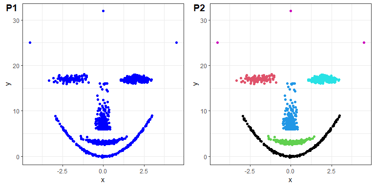
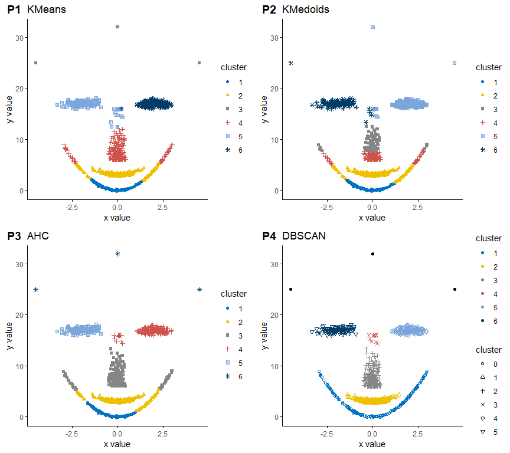

Wczytanie danych
================

    library(fpc)
    library(dplyr)
    library(aricode)
    library(factoextra)
    library(ggplot2)
    library(cowplot)

    set.seed(23)
    face <- rFace(1000, p=2, dMoNo=3)

    df = data.frame(x=face[,1], y=face[,2])
    labels = as.integer(attr(face,"grouping"))

    data_plot <- ggplot(df,aes(x,y)) +
      geom_point(col="blue")

    df_temp <- df %>% cbind(labels)
    gold_standard <- ggplot(df_temp,aes(x,y)) +
      geom_point(col=labels)

    plot_grid(data_plot, gold_standard, labels=c("P1", "P2"), ncol=2, nrow=1)

Trening różnych algorytmów grupowania
=====================================

### `k` wybrane metodą *gap statistic* VS `K` wybrane na podstawie etykiet

    # Według metody *gap statistic* najlepsze K = 4
    fviz_nbclust(df, kmeans, nstart = 25,  method = "gap_stat", nboot = 50)

    ## Clustering k = 1,2,..., K.max (= 10): .. done
    ## Bootstrapping, b = 1,2,..., B (= 50)  [one "." per sample]:
    ## .................................................. 50

    # Wybieramy jednak K zgodne z etykietami
    K = 6

### Algorytm k-średnich

    model_kmeans <- eclust(df, "kmeans", k = K, nstart = 25, graph = F)
    # Prediction

    # Model
    model_kmeans

    ## K-means clustering with 6 clusters of sizes 93, 359, 4, 230, 114, 200
    ## 
    ## Cluster means:
    ##             x          y
    ## 1 -0.24144366  0.7890811
    ## 2  0.13195497  3.2360747
    ## 3  0.00000000 28.5000000
    ## 4  0.08744587  7.3775333
    ## 5 -1.73002423 16.7279404
    ## 6  1.99777035 16.9699236
    ## 
    ## Clustering vector:
    ##    [1] 1 2 1 1 2 1 4 4 2 4 2 1 1 1 2 2 1 1 4 1 1 1 2 2 1 2 1 4 4 2 1 1 1 1 1 2 1 4 4 2 2 4 1 1 2 2 2 1 1 2 1 2 1 2 4 4 1 4 1 4 1 1 1 1 2 1 4 4 1 4 1 2
    ##   [73] 4 1 4 2 2 2 1 4 2 4 4 2 2 4 2 4 4 1 4 2 1 1 1 1 1 1 1 2 4 1 1 2 4 2 2 2 4 1 2 1 1 1 1 1 2 1 2 1 1 2 1 1 1 1 1 1 4 4 2 1 2 1 4 4 2 2 4 1 2 1 1 1
    ##  [145] 1 4 2 1 1 2 1 1 4 2 4 1 4 2 1 2 1 1 2 1 4 2 1 2 1 1 4 1 1 2 1 4 1 1 1 2 4 4 2 4 2 2 1 2 1 1 1 1 4 2 2 4 2 4 1 2 2 2 2 2 2 2 2 2 2 2 2 2 2 2 2 2
    ##  [217] 2 2 2 2 2 2 2 2 2 2 2 2 2 2 2 2 2 2 2 2 2 2 2 2 2 2 2 2 2 2 2 2 2 2 2 2 2 2 2 2 2 2 2 2 2 2 2 2 2 2 2 2 2 2 2 2 2 2 2 2 2 2 2 2 2 2 2 2 2 2 2 2
    ##  [289] 2 2 2 2 2 2 2 2 2 2 2 2 2 2 2 2 2 2 2 2 2 2 2 2 2 2 2 2 2 2 2 2 2 2 2 2 2 2 2 2 2 2 2 2 2 2 2 2 2 2 2 2 2 2 2 2 2 2 2 2 2 2 2 2 2 2 2 2 2 2 2 2
    ##  [361] 2 2 2 2 2 2 2 2 2 2 2 2 2 2 2 2 2 2 2 2 2 2 2 2 2 2 2 2 2 2 2 2 2 2 2 2 2 2 2 2 2 2 2 2 2 2 2 2 2 2 2 2 2 2 2 2 2 2 2 2 2 2 2 2 2 2 2 2 2 2 2 2
    ##  [433] 2 2 2 2 2 2 2 2 2 2 2 2 2 2 2 2 2 2 2 2 2 2 2 2 2 2 2 2 2 2 2 2 2 2 2 2 2 2 2 2 2 2 2 2 2 2 2 2 2 2 2 2 2 2 2 2 2 2 2 2 2 2 2 2 2 2 4 5 4 4 4 4
    ##  [505] 4 4 4 4 4 4 4 4 4 4 4 4 4 4 4 4 4 4 5 4 4 4 4 4 4 4 4 4 4 4 4 4 5 4 4 4 4 4 4 5 4 4 4 5 4 4 4 4 5 4 4 4 4 4 4 4 4 4 4 4 4 4 4 4 4 4 4 4 4 4 4 4
    ##  [577] 4 4 4 4 4 4 4 4 4 4 4 4 4 4 4 4 5 4 4 4 4 4 4 4 4 4 4 4 5 4 4 4 4 4 4 4 4 4 4 4 4 4 5 4 4 4 4 4 4 4 4 4 4 4 4 4 4 4 4 4 4 4 4 4 4 4 4 4 4 5 4 4
    ##  [649] 4 4 4 4 4 4 4 4 4 4 4 4 5 5 5 4 4 4 4 4 4 4 5 4 4 4 4 4 4 4 4 4 4 4 4 4 4 4 4 4 4 4 4 6 4 4 4 4 4 6 6 6 6 6 6 6 6 6 6 6 6 6 6 6 6 6 6 6 6 6 6 6
    ##  [721] 6 6 6 6 6 6 6 6 6 6 6 6 6 6 6 6 6 6 6 6 6 6 6 6 6 6 6 6 6 6 6 6 6 6 6 6 6 6 6 6 6 6 6 6 6 6 6 6 6 6 6 6 6 6 6 6 6 6 6 6 6 6 6 6 6 6 6 6 6 6 6 6
    ##  [793] 6 6 6 6 6 6 6 6 6 6 6 6 6 6 6 6 6 6 6 6 6 6 6 6 6 6 6 6 6 6 6 6 6 6 6 6 6 6 6 6 6 6 6 6 6 6 6 6 6 6 6 6 6 6 6 6 6 6 6 6 6 6 6 6 6 6 6 6 6 6 6 6
    ##  [865] 6 6 6 6 6 6 6 6 6 6 6 6 6 6 6 6 6 6 6 6 6 6 6 6 6 6 6 6 6 6 6 6 5 5 5 5 5 5 5 5 5 5 5 5 5 5 5 5 5 5 5 5 5 5 5 5 5 5 5 5 5 5 5 5 5 5 5 5 5 5 5 5
    ##  [937] 5 5 5 5 5 5 5 5 5 5 5 5 5 5 5 5 5 5 5 5 5 5 5 5 5 5 5 5 5 5 5 5 5 5 5 5 5 5 5 5 5 5 5 5 5 5 5 5 5 5 5 5 5 5 5 5 5 5 5 5 3 3 3 3
    ## 
    ## Within cluster sum of squares by cluster:
    ## [1] 106.20932 374.29779  89.50000 762.03654 187.61306  65.52071
    ##  (between_SS / total_SS =  96.2 %)
    ## 
    ## Available components:
    ## 
    ##  [1] "cluster"      "centers"      "totss"        "withinss"     "tot.withinss" "betweenss"    "size"         "iter"         "ifault"      
    ## [10] "silinfo"      "nbclust"      "data"

### Algorytm k-medoidów

    model_pam <- eclust(df, "pam", k = K, graph = F)
    model_pam

    ## Medoids:
    ##       ID            x         y
    ## [1,]  69 -0.480511756  0.378720
    ## [2,] 205  0.099172898  3.099743
    ## [3,] 505  0.007824188  8.839665
    ## [4,] 545 -0.017189896  6.582294
    ## [5,] 873  1.995332379 16.996319
    ## [6,] 902 -1.930762957 16.951077
    ## Clustering vector:
    ##    [1] 1 2 1 2 2 1 3 3 2 3 4 2 1 1 2 2 1 1 4 1 1 1 2 2 1 2 1 4 4 2 1 1 1 1 1 2 1 4 4 2 2 4 1 1 2 2 4 1 1 2 1 2 1 2 4 3 2 4 1 4 1 1 1 1 4 1 4 4 1 3 1 2
    ##   [73] 4 1 4 2 2 2 1 4 2 4 4 2 2 4 2 4 4 1 4 2 1 1 1 1 1 1 1 2 4 1 1 2 3 2 2 2 4 1 2 1 1 1 1 1 2 1 2 1 1 2 1 1 1 1 1 1 4 4 2 1 2 1 4 4 2 2 4 1 2 1 1 1
    ##  [145] 1 3 2 1 1 2 1 1 4 2 3 1 4 2 1 2 1 1 2 1 3 2 1 2 1 1 3 1 1 2 1 3 2 1 1 2 4 4 4 4 2 2 1 2 1 1 1 1 4 2 2 4 2 3 2 2 2 2 2 2 2 2 2 2 2 2 2 2 2 2 2 2
    ##  [217] 2 2 2 2 2 2 2 2 2 2 2 2 2 2 2 2 2 2 2 2 2 2 2 2 2 2 2 2 2 2 2 2 2 2 2 2 2 2 2 2 2 2 2 2 2 2 2 2 2 2 2 2 2 2 2 2 2 2 2 2 2 2 2 2 2 2 2 2 2 2 2 2
    ##  [289] 2 2 2 2 2 2 2 2 2 2 2 2 2 2 2 2 2 2 2 2 2 2 2 2 2 2 2 2 2 2 2 2 2 2 2 2 2 2 2 2 2 2 2 2 2 2 2 2 2 2 2 2 2 2 2 2 2 2 2 2 2 2 2 2 2 2 2 2 2 2 2 2
    ##  [361] 2 2 2 2 2 2 2 2 2 2 2 2 2 2 2 2 2 2 2 2 2 2 2 2 2 2 2 2 2 2 2 2 2 2 2 2 2 2 2 2 2 2 2 2 2 2 2 2 2 2 2 2 2 2 2 2 2 2 2 2 2 2 2 2 2 2 2 2 2 2 2 2
    ##  [433] 2 2 2 2 2 2 2 2 2 2 2 2 2 2 2 2 2 2 2 2 2 2 2 2 2 2 2 2 2 2 2 2 2 2 2 2 2 2 2 2 2 2 2 2 2 2 2 2 2 2 2 2 2 2 2 2 2 2 2 2 2 2 2 2 2 2 3 3 3 4 3 4
    ##  [505] 3 4 3 3 3 4 4 4 3 3 4 3 4 4 4 3 4 3 5 4 3 4 4 4 4 3 3 3 4 4 4 3 6 3 4 4 4 4 4 5 4 3 4 3 4 3 3 4 6 4 4 3 4 4 3 4 4 4 4 3 4 4 4 4 4 4 3 4 4 4 4 3
    ##  [577] 4 4 4 3 3 4 3 4 4 4 4 4 3 3 4 3 6 4 4 4 4 3 4 4 4 3 4 4 6 3 4 4 4 4 4 4 4 3 3 3 4 4 5 4 4 4 3 4 3 3 3 3 4 4 3 4 4 4 4 3 4 4 4 4 3 4 3 4 4 6 4 4
    ##  [649] 3 4 4 4 4 3 4 3 4 4 4 3 3 5 5 4 4 3 4 3 4 4 5 3 4 3 4 3 3 4 4 3 3 4 3 4 3 4 3 4 3 3 3 5 3 4 3 4 4 5 5 5 5 5 5 5 5 5 5 5 5 5 5 5 5 5 5 5 5 5 5 5
    ##  [721] 5 5 5 5 5 5 5 5 5 5 5 5 5 5 5 5 5 5 5 5 5 5 5 5 5 5 5 5 5 5 5 5 5 5 5 5 5 5 5 5 5 5 5 5 5 5 5 5 5 5 5 5 5 5 5 5 5 5 5 5 5 5 5 5 5 5 5 5 5 5 5 5
    ##  [793] 5 5 5 5 5 5 5 5 5 5 5 5 5 5 5 5 5 5 5 5 5 5 5 5 5 5 5 5 5 5 5 5 5 5 5 5 5 5 5 5 5 5 5 5 5 5 5 5 5 5 5 5 5 5 5 5 5 5 5 5 5 5 5 5 5 5 5 5 5 5 5 5
    ##  [865] 5 5 5 5 5 5 5 5 5 5 5 5 5 5 5 5 5 5 5 5 5 5 5 5 5 5 5 5 5 5 5 5 6 6 6 6 6 6 6 6 6 6 6 6 6 6 6 6 6 6 6 6 6 6 6 6 6 6 6 6 6 6 6 6 6 6 6 6 6 6 6 6
    ##  [937] 6 6 6 6 6 6 6 6 6 6 6 6 6 6 6 6 6 6 6 6 6 6 6 6 6 6 6 6 6 6 6 6 6 6 6 6 6 6 6 6 6 6 6 6 6 6 6 6 6 6 6 6 6 6 6 6 6 6 6 6 6 5 5 5
    ## Objective function:
    ##     build      swap 
    ## 0.8846034 0.8528677 
    ## 
    ## Available components:
    ##  [1] "medoids"    "id.med"     "clustering" "objective"  "isolation"  "clusinfo"   "silinfo"    "diss"       "call"       "data"       "nbclust"

### Algorytm AHC (Agglomerative Hierarchical Clustering)

    model_ahc <- eclust(df, "hclust", k = K, hc_metric = "euclidean", hc_method = "ward.D2", graph = F)
    model_ahc

    ## 
    ## Call:
    ## stats::hclust(d = x, method = hc_method)
    ## 
    ## Cluster method   : ward.D2 
    ## Distance         : euclidean 
    ## Number of objects: 1000

### Algorytm DBSCAN (Density-Based Spatial Clustering and Application with Noise)

    model_dbscan <- fpc::dbscan(df, eps=0.8, MinPts=3)
    model_dbscan

    ## dbscan Pts=1000 MinPts=3 eps=0.8
    ##        0   1   2   3   4
    ## border 5   0   0   0   0
    ## seed   0 498 187 111 199
    ## total  5 498 187 111 199

Ocena jakości skupień
=====================

### Porównanie z pomocą miary AMI (Adjusted Mutual Information)

    "AMI metric comaprison:"

    ## [1] "AMI metric comaprison:"

    paste0("   - KMeans - ", AMI(model_kmeans$cluster, labels))

    ## [1] "   - KMeans - 0.793381058555524"

    paste0("   - KMedoids - ", AMI(model_pam$cluster, labels))

    ## [1] "   - KMedoids - 0.744069041000001"

    paste0("   - AHC - ", AMI(model_ahc$cluster, labels))

    ## [1] "   - AHC - 0.786545545246732"

    paste0("   - DBSCAN - ", AMI(model_dbscan$cluster, labels))

    ## [1] "   - DBSCAN - 0.763216702337863"

Porównanie z pomocą macierzy pomyłek
====================================

    "Confusion matrices comaprison:"

    ## [1] "Confusion matrices comaprison:"

    cat("\n\t   - KMeans - ")

    ## 
    ##     - KMeans -

    table(labels, model_kmeans$cluster)

    ##       
    ## labels   1   2   3   4   5   6
    ##      1  93  60   0  46   0   0
    ##      2   0   0   0   0 100   0
    ##      3   0 299   0   0   0   0
    ##      4   0   0   0 184  14   1
    ##      5   0   0   0   0   0 199
    ##      6   0   0   4   0   0   0

    cat("\n\t   - KMedoids - ")

    ## 
    ##     - KMedoids -

    table(labels, model_pam$cluster)

    ##       
    ## labels   1   2   3   4   5   6
    ##      1  88  61  12  38   0   0
    ##      2   0   0   0   0   0 100
    ##      3   0 299   0   0   0   0
    ##      4   0   0  70 117   7   5
    ##      5   0   0   0   0 199   0
    ##      6   0   0   0   0   3   1

    cat("\n\t   - AHC - ")

    ## 
    ##     - AHC -

    table(labels, model_ahc$cluster)

    ##       
    ## labels   1   2   3   4   5   6
    ##      1  84  68  47   0   0   0
    ##      2   0   0   0   0 100   0
    ##      3   0 299   0   0   0   0
    ##      4   0   0 188  11   0   0
    ##      5   0   0   0 199   0   0
    ##      6   0   0   0   0   0   4

    cat("\n\t   - DBSCAN - ")

    ## 
    ##     - DBSCAN -

    table(labels, model_dbscan$cluster)

    ##       
    ## labels   0   1   2   3   4
    ##      1   0 199   0   0   0
    ##      2   0   0   0 100   0
    ##      3   0 299   0   0   0
    ##      4   1   0 187  11   0
    ##      5   0   0   0   0 199
    ##      6   4   0   0   0   0

Porównanie z pomocą wizualizacji
================================

    plot_kmeans <- fviz_cluster(model_kmeans, df, stand=F, ellipse=F, show.clust.cent=F, geom="point", palette="jco", ggtheme= theme_classic()) +
                    labs(title="KMeans")
    plot_pam <- fviz_cluster(model_pam, df, stand=F, ellipse=F, show.clust.cent=F, geom="point", palette="jco", ggtheme= theme_classic()) +
                    labs(title="KMedoids")
    plot_ahc <- fviz_cluster(model_ahc, df, stand=F, ellipse=F, show.clust.cent=F, geom="point", palette="jco", ggtheme= theme_classic()) +
                    labs(title="AHC")
    plot_dbscan <- fviz_cluster(model_dbscan, df, stand=F, ellipse=F, show.clust.cent=F, geom="point", palette="jco", ggtheme= theme_classic()) +
                    labs(title="DBSCAN")
    plot_grid(plot_kmeans, plot_pam, plot_ahc, plot_dbscan, labels=c("P1", "P2", "P3", "P4"), ncol=2, nrow=2)

